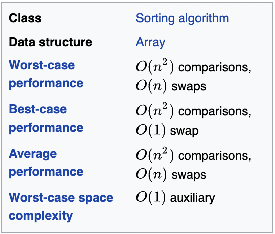

# TD2

## Notations asymptotiques

1. Caractériser les fonctions suivantes en terme de notation O ("grand O") :

- O(n^3)
- O(n^2)
- O(n*log_2(n))

2. Parmi les fonctions suivantes, quelles sont celles qui ont le même ordre de grandeur ?

- f1 | f3 | f4
- f2

3. En utilisant la définition de theta montrer que f(n) + g(n) = theta(max(f(n), g(n)))

```
D'une part : 
theta(f(n)) <= theta(max(f(n), g(n)))
theta(g(n)) <= theta(max(f(n), g(n)))

theta(f(n)) + theta(g(n)) <= 2 * theta(max(f(n), g(n)))
theta(f(n)) + theta(g(n)) <= theta(max(f(n), g(n)))

D'autre part :
max(f(n), g(n)) <= f(n) + g(n)
theta(max(f(n), g(n))) <= theta(f(n)) + theta(g(n))

Donc : theta(f(n) + g(n)) = theta(max(f(n), g(n)))
```

## Complexité

4. Exprimer en fonction de n le nombre de fois où est effectué `res+ = c` dans les méthodes `String repete1(char c,int n)` 
et `String repete2(char c,int n)`. Ces deux méthodes ont-elles la même complexité ?

Complexité de `repete1` : n^2
Complexité de `repete2` : n*(n-1) / 2 

5. On s’intéresse à la méthode de tri appelée **“tri par sélection”** vue au 1er semestre et fournie dans la classe 
`TableauGenerique`. Compléter les propriétés P1 et P2 et expliquer comment fonctionne ce tri. Calculez la complexité 
dans le pire et le meilleur des cas de la méthode “triSelection”.



6. Calculer la complexité dans le pire des cas de la méthode `rechercheVite` du cours (compter le nombre de passages 
dans la boucle while).

Complexité dans le pire des cas : O(log(n))  
Justification : n/2^k <=> k = log_2(n)

7. On considère la méthode `mystere` de la classe `ValiditeComplexite` :
   - Que vaut mystere(“Bonjour′′) ?
   - Donner les propriétés P1, P2 et la post-condition. Pour P1, vous pouvez utiliser le schéma ci-dessous.
   - Calculer la complexité de la méthode `public String mystere(String m)`.
     - O(n) ?